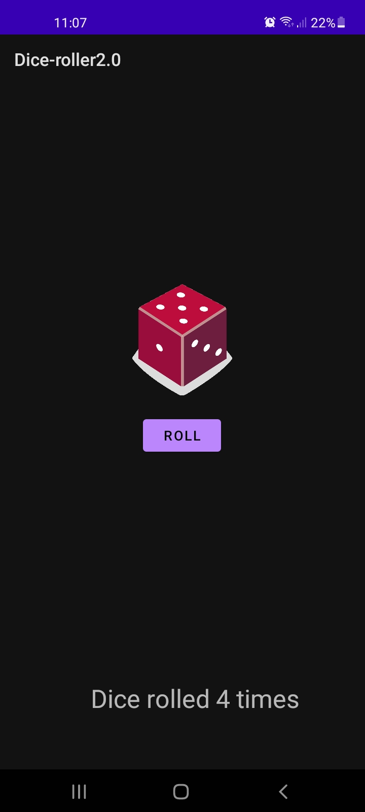

# Dice Roller2.0 

This repo contains my first Android app, a simple dice roller. 
The UI is pretty straight forward. There is a "ROLL" button which 
generates a new random number. Then, according the number generated, 
the correspoding image of the dice appears to the screen. 

In addition, there is a text view at the bottom showing the total 
number of rolls. 

This implementation is with Android studio and Kotlin. 

